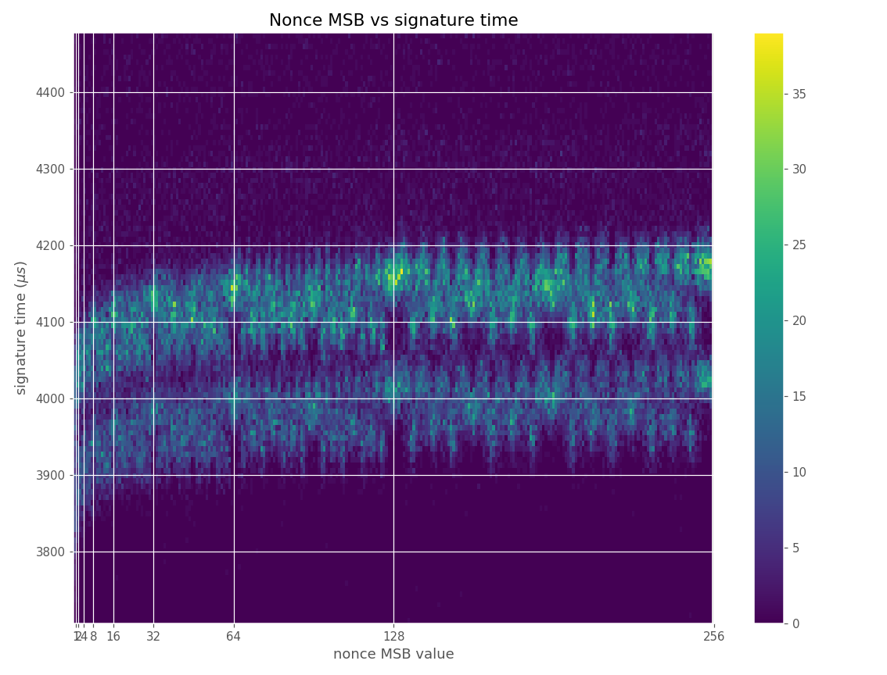
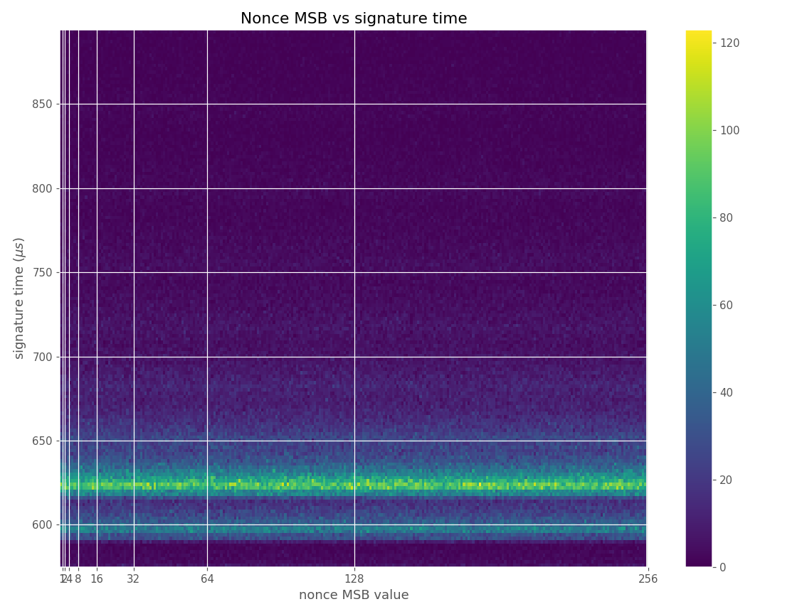

# 

[](https://travis-ci.org/crocs-muni/ECTester) [](https://ci.appveyor.com/project/J08nY/ectester-cm6ng) [](https://github.com/crocs-muni/ECTester/releases)  [](https://github.com/crocs-muni/ECTester/blob/master/LICENSE) [](https://crocs-muni.github.io/ECTester/)

ECTester is a tool for testing and analysis of elliptic curve cryptography implementations on JavaCards and in cryptographic libraries. It consists of four separate parts:

 - The ECTester applet, a JavaCard applet that provides the testing interface
 - The ECTesterReader app, a reader app that works with the applet
 - The ECTesterStandalone app, which works with software libraries
 - Jupyter notebooks for analysis and visualization of data from the apps

For more information on ECC support on JavaCards see the [github page](https://crocs-muni.github.io/ECTester/), with results, tables and docs.

This project is developed by the [Centre for Research On Cryptography and Security](https://crocs.fi.muni.cz) at Faculty of Informatics, Masaryk University.

## Contents

 - [Setup](#setup)
 - [JavaCard testing](#javacard-testing): [Examples](#examples)
 - [Standalone library testing](#standalone-library-testing): [Examples](#examples-1)
 - [Analysis](#analysis): [Examples](#examples-2)

## Other documentation

 - [TESTS](docs/TESTS.md): Description of card test suites.
 - [CURVES](docs/CURVES.md): Description of curve and test data contained in ECTester.
 - [FORMAT](docs/FORMAT.md): Description of input and output formats used by ECTester.
 - [LIBS](docs/LIBS.md): List of cryptographic libraries supported by ECTester and their characteristics.
 - [VULNS](docs/VULNS.md): List of vulnerabilities discovered using ECTester.

## Setup

ECTester uses Java 8 and ant. There are three parts of ECTester, the JavaCard applet used for testing, the reader app which controls it and the standalone app which tests software libraries. The target platform for ECTester is Linux, but things should work on Windows as well, although testing of standalone libraries will be limited to Java libraries and Microsoft CNG library.

To build ECTester simply do:
```bash
git submodule update --init --recursive       # To initialize submodules (JavaCard SDKs, Microsoft CNG, BoringSSL, ...)
ant -f build-reader.xml package               # To build the reader tool (jar) -> "dist/ECTesterReader.jar"
ant -f build-standalone.xml package           # To build the standalone tool (jar) -> "dist/ECTesterStandalone.jar"
ant -f build-applet.xml build                 # To build the applet (cap) -> "applet/ectester.cap".
```
Build produces both a lightweight version of the JARs and a full version of the JARs with dependencies included, the latter has the `*-dist.jar` suffix.

The applet comes in two flavors, targeting JavaCard 2.2.1 and 2.2.2. The 2.2.2 version supports extended length APDUs which are necessary for some commands to work properly. Use the `cap` ant property to specify which CAP file to build, either `ectester221.cap` or `ectester222.cap`.

To build the 221 version do:
```bash
ant -f build-applet.xml build -Dcap=ectester221.cap
```

The `build-standalone.xml` ant build file invokes a Makefile (or a Makefile.bat on Windows) in `src/cz/crcs/ectester/standalone/libs/jni`, which tries to build the C/C++ shim libraries required for ECTester to test the actual native cryptographic libraries from Java. The Makefile uses pkg-config to locate the libraries installed, thus if non-standard location of the tested libraries is used, the Makefile or your pkg-config needs some changes to work.

See the section on [setup](#setup-1) of standalone library testing for more details.

## JavaCard testing

The JavaCard part of ECTester targets testing elliptic curve cryptography implementations in programmable smart cards of the JavaCard platform, version 2.2.1 and up. The reader app supports many actions, the main one being [testing](#test): the running of predetermined test suites that test the JavaCard for support, performance and vulnerabilities. The other actions focus on data collection, [generating keys](#generate), [signing data](#ecdsa), [performing key agreement](#ecdh) or [exporting the preset curves](#export), output of the mentioned actions can then be analyzed using the Jupyter notebooks, see [analysis](#analysis).

1. Upload `applet/ectester.cap` using your favorite tool (e.g., [GlobalPlatformPro tool](https://github.com/martinpaljak/GlobalPlatform)) or the `build-applet.xml` ant file (target `upload` or `upload-emv`).
2. Run `java -jar dist/ECTesterReader.jar -t` or other data collection commands.
3. Inspect output log with annotated results.

Following operations are tested in the default test suite, which is just a basic support test suite:

- Allocation of new KeyPair class for specified parameters
- Generation of KeyPair with default curve
- Setting of custom curve and KeyPair generation
- Generation of shared secret via ECDH
- Signature via ECDSA

See `java -jar ECTesterReader.jar -h`, `java -jar ECTesterReader.jar -ls` and [TESTS](docs/TESTS.md) for more.

### Actions

Actions for the reader app, exactly one of which is required for every run.

#### Test
`-t / --test [test_suite]`

Perform support, performance and vulnerability tests of ECC.

Currently supported test suites include:

 - `default`
 - `test-vectors`
 - `compression`
 - `miscellaneous`
 - `signature`
 - `wrong`*
 - `invalid`*
 - `twist`*
 - `degenerate`*
 - `composite`*
 - `cofactor`*
 - `edge-cases`*

**\*NOTE: The `wrong`, `composite`, `invalid`,`twist`, `cofactor`, `edge-cases` and `degenerate` test suites caused temporary/permanent DoS of some cards. These test suites prompt you for
confirmation before running, be cautious.**

To select which tests will be performed, it is possible to enter the test suite name with a suffix
which specifies the number of the first test to be run, and optionally the number of the last test to be run as `-t <test_suite>[:start_index[:stop_index]]`.

Use with `-o / --output [out_type:]<out_file>` to output the test results to a file.
For possible formats of this file see [FORMAT](docs/FORMAT.md).
For more info about the test suites see [TESTS](docs/TESTS.md).

#### Export
`-e / --export`

Exports the default curves (if any) that are preset on the card.
Use with `-o / --output [out_file]` to output the curve parameters to a file.
For format of this file see [FORMAT](docs/FORMAT.md).

#### Generate
`-g / --generate [amount]`

Generates batch of EC keypairs and exports them.

Use with `-o / --output [out_file]` to output the generated keys to a file.
Use with `--time` to measure time as a difference of real duration of the operation and the dry-run duration of the operation.
For format of this file see [FORMAT](docs/FORMAT.md).

#### ECDH
`-dh / --ecdh [count]`

Performs ECDH.

Use with `-o / --output [out_file]` to output into a file.
Use with `--time` to measure time as a difference of real duration of the operation and the dry-run duration of the operation.
For format of this file see [FORMAT](docs/FORMAT.md).
Respects the KeyAgreement type specified in `-ka / --ka-type [type]`.


#### ECDSA
`-dsa / --ecdsa [count]`

Performs ECDSA.
Useful with `-i / --input [in_file]` to sign the contents of a file.
Use with `-o / --output [out_file]` to output into a file.
Use with `--time` to measure time as a difference of real duration of the operation and the dry-run duration of the operation.
For format of these files see [FORMAT](docs/FORMAT.md).
Respects the Signature type specified in `-sig / --sig-type [type]`.

#### List named curves
`-ln / --list-named [category/name]`

Lists categories of curves, keys and keypairs embedded in ECTester's jar, along with some information about them.
These can be used as arguments to the `-n[c|k|pub|priv] / --named-[curve|key|public|private]` parameters, using the format: `category/name`.

For example:
`secg/secp192r1` identifies the SECG 192 bit prime field curve known as `secp192r1`.

For more info about the curves and curve categories see [CURVES](docs/CURVES.md).

#### List test suites
`-ls / --list-suites`

Lists the implemented test suites and gives their short description.

#### Get applet info
`-nf / --info`

Get and print ECTester applet info from an applet installed on a card.

Outputs:

 - Card ATR
 - Negotiated protocol (T=0/T=1)
 - ECTester applet version
 - ECTester APDU support (basic/extended APDU)
 - JavaCard API version
 - JavaCard cleanup support
 - ECTester internal array sizes and APDU buffer size

### Examples

Snippet below shows running the default test suite while simulating(`-s`), so using JCardSim.
This shows that JCardsim simulates 112b Fp support with default curve present and supports ECDH, ECDHC and ECDSA.

```
> java -jar ECTesterReader.jar -t -s
═══ Running test suite: default ═══
═══ The default test suite tests basic support of ECDH and ECDSA.
═══ Date: 2018.05.02 20:29:38
═══ ECTester version: v0.3.0
═══ Card ATR: 3bfa1800008131fe454a434f5033315632333298
■━━━┳━━━━━━━━━━━━━━━━━━━━━━━━━━━━━━━━━━━━━━━━━━━━━━━━━━━━━━━━━━━━━━━━━━━━━━━━━━━━━━━━━━━━━━━━━━━━━━━━━━━━━┳━━━━━━━━━━━┳━━━━━━━━━┓
 OK ╋ (0) Get applet info: v0.3.0; 3.0; basic                                                             ┃ SUCCESS   ┃ All sub-tests had the expected result.
    ┗  OK ━ Get applet info                                                                               ┃ SUCCESS   ┃    0 ms ┃  OK   (0x9000)
■━━━┳━━━━━━━━━━━━━━━━━━━━━━━━━━━━━━━━━━━━━━━━━━━━━━━━━━━━━━━━━━━━━━━━━━━━━━━━━━━━━━━━━━━━━━━━━━━━━━━━━━━━━┳━━━━━━━━━━━┳━━━━━━━━━┓
 OK ╋ (1) Tests of 112b ALG_EC_FP support.                                                                ┃ SUCCESS   ┃ All sub-tests matched the expected mask.
    ┣  OK ━ Allocate both keypairs 112b ALG_EC_FP                                                         ┃ SUCCESS   ┃  166 ms ┃  OK   (0x9000) OK   (0x9000)
    ┣  OK ━ Generate both keypairs                                                                        ┃ SUCCESS   ┃   19 ms ┃  OK   (0x9000) OK   (0x9000)
    ┣  OK ━ Allocate both keypairs 112b ALG_EC_FP                                                         ┃ SUCCESS   ┃    0 ms ┃  OK   (0x9000) OK   (0x9000)
    ┣  OK ━ Set custom curve parameters on both keypairs                                                  ┃ SUCCESS   ┃    0 ms ┃  OK   (0x9000) OK   (0x9000)
    ┣  OK ━ Generate both keypairs                                                                        ┃ SUCCESS   ┃    5 ms ┃  OK   (0x9000) OK   (0x9000)
    ┣  OK ┳ KeyAgreement tests.                                                                           ┃ SUCCESS   ┃ Some sub-tests did have the expected result.
    ┃     ┣  OK ┳ Test of the ALG_EC_SVDP_DH KeyAgreement.                                                ┃ SUCCESS   ┃ Some ECDH is supported.
    ┃     ┃     ┣  OK ━ Allocate KeyAgreement(ALG_EC_SVDP_DH) object                                      ┃ SUCCESS   ┃    1 ms ┃  OK   (0x9000)
    ┃     ┃     ┣  OK ━ ALG_EC_SVDP_DH of local pubkey and remote privkey                                 ┃ SUCCESS   ┃    2 ms ┃  OK   (0x9000)
    ┃     ┃     ┣  OK ━ ALG_EC_SVDP_DH of local pubkey and remote privkey(COMPRESSED point)               ┃ SUCCESS   ┃    3 ms ┃  OK   (0x9000)
    ┃     ┃     ┗  OK ━ Mean = 1879950 ns, Median = 1835076 ns, Mode = 1763287 ns                         ┃ SUCCESS   ┃    1 ms ┃  OK   (0x9000)
    ┃     ┣  OK ┳ Test of the ALG_EC_SVDP_DHC KeyAgreement.                                               ┃ SUCCESS   ┃ Some ECDH is supported.
    ┃     ┃     ┣  OK ━ Allocate KeyAgreement(ALG_EC_SVDP_DHC) object                                     ┃ SUCCESS   ┃    0 ms ┃  OK   (0x9000)
    ┃     ┃     ┣  OK ━ ALG_EC_SVDP_DHC of local pubkey and remote privkey                                ┃ SUCCESS   ┃    1 ms ┃  OK   (0x9000)
    ┃     ┃     ┣  OK ━ ALG_EC_SVDP_DHC of local pubkey and remote privkey(COMPRESSED point)              ┃ SUCCESS   ┃    2 ms ┃  OK   (0x9000)
    ┃     ┃     ┗  OK ━ Mean = 1748499 ns, Median = 1760792 ns, Mode = 1647372 ns                         ┃ SUCCESS   ┃    1 ms ┃  OK   (0x9000)
    ┃     ┣ NOK ━ Allocate KeyAgreement(ALG_EC_SVDP_DH_PLAIN) object                                      ┃ FAILURE   ┃    0 ms ┃  fail (NO_SUCH_ALG, 0x0003)
    ┃     ┣ NOK ━ Allocate KeyAgreement(ALG_EC_SVDP_DHC_PLAIN) object                                     ┃ FAILURE   ┃    0 ms ┃  fail (NO_SUCH_ALG, 0x0003)
    ┃     ┣ NOK ━ Allocate KeyAgreement(ALG_EC_PACE_GM) object                                            ┃ FAILURE   ┃    0 ms ┃  fail (NO_SUCH_ALG, 0x0003)
    ┃     ┗ NOK ━ Allocate KeyAgreement(ALG_EC_SVDP_DH_PLAIN_XY) object                                   ┃ FAILURE   ┃    0 ms ┃  fail (NO_SUCH_ALG, 0x0003)
    ┗  OK ┳ Signature tests.                                                                              ┃ SUCCESS   ┃ Some sub-tests did have the expected result.
          ┣  OK ┳ Test of the ALG_ECDSA_SHA signature.                                                    ┃ SUCCESS   ┃ All sub-tests had the expected result.
          ┃     ┣  OK ━ Allocate Signature(ALG_ECDSA_SHA) object                                          ┃ SUCCESS   ┃    2 ms ┃  OK   (0x9000)
          ┃     ┣  OK ━ ALG_ECDSA_SHA with local keypair(random data)                                     ┃ SUCCESS   ┃   17 ms ┃  OK   (0x9000)
          ┃     ┣  OK ━ Sign (Mean = 1451086 ns, Median = 1413292 ns, Mode = 1378296 ns)                  ┃ SUCCESS   ┃    1 ms ┃  OK   (0x9000)
          ┃     ┗  OK ━ Verify (Mean = 1850022 ns, Median = 1837022 ns, Mode = 1744613 ns)                ┃ SUCCESS   ┃    1 ms ┃  OK   (0x9000)
          ┣ NOK ━ Allocate Signature(ALG_ECDSA_SHA_224) object                                            ┃ FAILURE   ┃    0 ms ┃  fail (NO_SUCH_ALG, 0x0003)
          ┣ NOK ━ Allocate Signature(ALG_ECDSA_SHA_256) object                                            ┃ FAILURE   ┃    0 ms ┃  fail (NO_SUCH_ALG, 0x0003)
          ┣ NOK ━ Allocate Signature(ALG_ECDSA_SHA_384) object                                            ┃ FAILURE   ┃    0 ms ┃  fail (NO_SUCH_ALG, 0x0003)
          ┗ NOK ━ Allocate Signature(ALG_ECDSA_SHA_512) object                                            ┃ FAILURE   ┃    0 ms ┃  fail (NO_SUCH_ALG, 0x0003)
```

#### Legend
 - Some general information about the test suite and card is output first, test data follows after.
 - The **OK**/**NOK** values on the left represent the complete evaluated result of a test, as a test can be expected
   to succeed or fail, this is different than the values on the right:
   - **SUCCESS**: Is **OK**, the test was expected to pass and it did.
   - **FAILURE**: Is **NOK**, the test was expected to pass, but it did not.
   - **UXSUCCESS**: Is **NOK**, the test was expected to fail, but it did not.
   - **XFAILURE**: Is **OK**, the test was expected to fail, and it did.
   - **ERROR**: Is **NOK** an unexpected error during testing arose.
 - The tests can be compounded into compound tests, which are visible as a tree of tests and sub-tests.
 - The duration of non-compound tests is shown in the third column, this is a rough estimate, measured from before the APDU is sent, to just after the response is received.
 - The cause of the test result, is shown in the last column, for non-compound tests, these are JavaCard(or custom) status words, from operations done on the card.

If you are interested in testing support for other JavaCard algorithms, please visit JCAlgTester project: https://github.com/crocs-muni/JCAlgTest


Snippet below shows collection of 1000 of ECDSA signatures (`--ecdsa`) over a prime field (`-fp`) 160 bit (`-b`) curve, which will be the `secp160r1` curve, because of the `-u` switch, which selects one of the SECG curves for the bit-length. The applet signes randomly generated but static data using a fixed key (`--fixed`). Timing data is collected and output in nanoseconds (`--time-unit`) and output into `out.csv`.
```
> java -jar ECTesterReader.jar --ecdsa 1000 -fp -b 160 -u --fixed --time-unit nano -o out.csv
Allocate Signature(ALG_ECDSA_SHA) object                               ┃   10 ms ┃  OK   (0x9000)
Allocate local keypair 160b ALG_EC_FP                                  ┃   57 ms ┃  OK   (0x9000)
Set secp160r1 curve parameters on local keypair                        ┃    0 ms ┃  OK   (0x9000)
Generate local keypair                                                 ┃   49 ms ┃  OK   (0x9000)
Export keypair params from both keys of local keypair                  ┃    0 ms ┃  OK   (0x9000)
ALG_ECDSA_SHA signature with local keypair(provided data)              ┃   31 ms ┃  OK   (0x9000)
ALG_ECDSA_SHA verification with local keypair(provided data)           ┃   40 ms ┃  OK   (0x9000)
ALG_ECDSA_SHA signature with local keypair(provided data)              ┃   12 ms ┃  OK   (0x9000)
ALG_ECDSA_SHA verification with local keypair(provided data)           ┃   19 ms ┃  OK   (0x9000)
ALG_ECDSA_SHA signature with local keypair(provided data)              ┃   14 ms ┃  OK   (0x9000)
ALG_ECDSA_SHA verification with local keypair(provided data)           ┃   19 ms ┃  OK   (0x9000)
ALG_ECDSA_SHA signature with local keypair(provided data)              ┃   14 ms ┃  OK   (0x9000)
...
```

The output of the above command, `out.csv` looks something like this:
```
index;signTime[nano];verifyTime[nano];data;pubW;privS;signature[SHA1];nonce;valid
0;26255357;28391390;a82187036e952ef2facb119b283883473944a0705f6e5979bf941789006b1b66;0463456917124646414c737ab5b2f83cf14d87139d047eac35b3e045a3e779ba345150d02e334454a8;3ebe95d4fda4988e000cba9b0cce25992da0f11d;302c02144be3feb924778b4ef4dff059935a53ca38b5016c02144161ca9cce5afbe2d06fd37379200eec0ad9c9d3;00c79485ede7e464b8c37312008fc54fea69d75463;1
1;14306042;20846855;a82187036e952ef2facb119b283883473944a0705f6e5979bf941789006b1b66;0463456917124646414c737ab5b2f83cf14d87139d047eac35b3e045a3e779ba345150d02e334454a8;3ebe95d4fda4988e000cba9b0cce25992da0f11d;302d021500a3684c699aded3af7b6e9c2d5bd033974443588c02143ee89959bb25c524da19b90f852e0dfcdb4ed6f6;00d9e1ad90d83dd3fc23b91061de6abf094e23e15a;1
2;16327883;18140346;a82187036e952ef2facb119b283883473944a0705f6e5979bf941789006b1b66;0463456917124646414c737ab5b2f83cf14d87139d047eac35b3e045a3e779ba345150d02e334454a8;3ebe95d4fda4988e000cba9b0cce25992da0f11d;302d0214429d54da93314437c5e1dd8a5244050f6b810dd3021500b989c5f990e702f319fb862d74172f5cc704e968;6206c53cabfc51fdcce5b5c551f091ddc5064dc2;1
3;19589990;37379094;a82187036e952ef2facb119b283883473944a0705f6e5979bf941789006b1b66;0463456917124646414c737ab5b2f83cf14d87139d047eac35b3e045a3e779ba345150d02e334454a8;3ebe95d4fda4988e000cba9b0cce25992da0f11d;302c02142017caabf802f18c5ac26d7b9c4679d34fcbd335021442a6dd6d63e136a27cda25e0e6197db4a30a9609;00ecdd91d35735d084dfb912d4aeca7e3f68cf2cd5;1
4;15369903;22086733;a82187036e952ef2facb119b283883473944a0705f6e5979bf941789006b1b66;0463456917124646414c737ab5b2f83cf14d87139d047eac35b3e045a3e779ba345150d02e334454a8;3ebe95d4fda4988e000cba9b0cce25992da0f11d;302e021500c82cb5d17aa2c1e13659c3ee0be8896f8e416731021500a1bdbfb48c46490c82af88f590c79d5770916c79;0094f752027314501b3586295c660576c184d9c9ee;1
```
This output can be then analysed using Jupyter notebooks in the `util` directory, see [analysis](#analysis) for more.

Snippet below shows output of the info command:
```
> java -jar ECTesterReader.jar -nf
Card ATR:				                3bdb960080b1fe451f830031c064c308010001900095
Card protocol:				            T=1
ECTester applet version:		        v0.3.3
ECTester applet APDU support:		    extended length
JavaCard API version:			        2.2
JavaCard supports system cleanup:	    true
Array sizes (apduBuf,ram,ram2,apduArr):	635 256 256 512
```


## Standalone library testing

The standalone part of ECTester targets testing elliptic curve cryptography implementations in Java and native cryptographic libraries.

Currently supported libraries include:

 - [BouncyCastle](https://bouncycastle.org/java.html) (Java)
 - [Sun EC](https://docs.oracle.com/javase/7/docs/technotes/guides/security/SunProviders.html#SunEC) (Java)
 - [OpenSSL](https://www.openssl.org/)
 - [BoringSSL](https://boringssl.googlesource.com/boringssl)
 - [wolfSSL](https://www.wolfssl.com/)
 - [Crypto++](https://cryptopp.com/)
 - [libtomcrypt](http://www.libtom.net/LibTomCrypt/)
 - [libgcrypt](https://www.gnupg.org/related_software/libgcrypt/)
 - [Botan](https://botan.randombit.net/)
 - [Microsoft CNG](https://msdn.microsoft.com/en-us/library/windows/desktop/aa376210(v=vs.85).aspx)
 - [Intel Performance Primitives Crypto](https://github.com/intel/ipp-crypto)
 - [MatrixSSL](https://github.com/matrixssl/matrixssl)
 - [MbedTLS](https://github.com/ARMmbed/mbedtls)
 - [Nettle](https://www.lysator.liu.se/~nisse/nettle/)
 - [LibreSSL](https://www.libressl.org/)

For more information on ECC libraries see [LIBS](docs/LIBS.md).

### Setup

Simply doing `ant -f build-standalone.xml package` should build everything necessary to teste libraries via the standalone app, the sections below describe the details of how that works and what needs to be done if it doesn't.

To see whether your build was sucessful, go to the `dist` directory, run:
`java -jar ECTesterStandalone.jar list-libs` and observe if your target libraries are included in the output. If they are not, and they are native libraries, it means that either the shim library was not built successfully or that the actual native library couldn't be found and loaded on runtime. To solve the former, look for build errors during the ant run in the `libs-try` step, for the latter, if the library is in an non-standard location specifying `LD_LIBRARY_PATH` will help load it. Consulting the next sections should help solve both.

#### Native

ECTester interfaces with native libraries by using custom shim libraries that expose the functionality via the [Java Native Interface](https://en.wikipedia.org/wiki/Java_Native_Interface), these can be found in the [src/cz/crcs/ectester/standalone/libs/jni](src/cz/crcs/ectester/standalone/libs/jni) directory along with a Makefile (Makefile.bat for Windows). The shim library will depend on the native library, and have a name like `boringssl_provider.so`, `botan_provider.so`, `cryptopp_provider.so` and `openssl_provider.so`. The Makefile has a target for every library that it supports that builds its shim, see the `help` target for more info. The Makefile is automatically ran when the `build-standalone.xml` ant build is triggered, so if all is setup correctly, you do not need to deal with the Makefile while building.

There are two important environmental variables that should be set in your environment. First, you should set `JAVA_HOME` which should point to your JDK. The tooling uses `JAVA_HOME` to locate native Java library headers, like `jni.h`. Second, ECTester uses pkg-config to locate the native libraries, if your pkg-config files are in an unusual place the pkg-config command would not find them by default, you should set `PKG_CONFIG_PATH` to the directory containing the `*.pc` files. If pkg-config files are unavailable for the library you are trying to test, you will need to change the Makefile manually to apply the correct options to the commands (CFLAGS, include options, linker options...).

Below you can see how a full build with all the libraries currently supported on Linux looks
```
> cd src/cz/crcs/ectester/standalone/libs/jni
> make
cc -DLTM_DESC -I/usr/local/include  -fPIC -I"/usr/lib/jvm/java-8-openjdk/include" -I"/usr/lib/jvm/java-8-openjdk/include/linux" -I. -O2 -c tomcrypt.c
cc -fPIC -I"/usr/lib/jvm/java-8-openjdk/include" -I"/usr/lib/jvm/java-8-openjdk/include/linux" -I. -O2 -c c_utils.c
cc -o lib_timing.so -shared -fPIC -I"/usr/lib/jvm/java-8-openjdk/include" -I"/usr/lib/jvm/java-8-openjdk/include/linux" -I. -O2 -Wl,-soname,lib_timing.so c_timing.c
g++ -I/usr/include/botan-2  -fPIC -I"/usr/lib/jvm/java-8-openjdk/include" -I"/usr/lib/jvm/java-8-openjdk/include/linux" -I. -O2 -c botan.cpp
g++ -fPIC -I"/usr/lib/jvm/java-8-openjdk/include" -I"/usr/lib/jvm/java-8-openjdk/include/linux" -I. -O2 -c cpp_utils.cpp
g++ -I/usr/local/include  -fPIC -I"/usr/lib/jvm/java-8-openjdk/include" -I"/usr/lib/jvm/java-8-openjdk/include/linux" -I. -O2 -c cryptopp.cpp
cc  -fPIC -I"/usr/lib/jvm/java-8-openjdk/include" -I"/usr/lib/jvm/java-8-openjdk/include/linux" -I. -O2 -c openssl.c
cc -I../../../../../../../ext/boringssl/include/ -fPIC -I"/usr/lib/jvm/java-8-openjdk/include" -I"/usr/lib/jvm/java-8-openjdk/include/linux" -I. -O2 -c boringssl.c
cp ../../../../../../../ext/boringssl/build/crypto/libcrypto.so lib_boringssl.so
cc  -fPIC -I"/usr/lib/jvm/java-8-openjdk/include" -I"/usr/lib/jvm/java-8-openjdk/include/linux" -I. -O2 -c gcrypt.c
cc -fPIC -I"/usr/lib/jvm/java-8-openjdk/include" -I"/usr/lib/jvm/java-8-openjdk/include/linux" -I. -O2 -c mbedtls.c
cc -fPIC -I"/usr/lib/jvm/java-8-openjdk/include" -I"/usr/lib/jvm/java-8-openjdk/include/linux" -I. -O2 -c ippcp.c
cc -fPIC -I"/usr/lib/jvm/java-8-openjdk/include" -I"/usr/lib/jvm/java-8-openjdk/include/linux" -I. -O2 -Imatrixssl/ -c matrixssl.c
cc -fPIC -shared -O2 -o tomcrypt_provider.so -Wl,-rpath,'$ORIGIN/lib' tomcrypt.o c_utils.o -L. -ltommath -L/usr/local/lib -ltomcrypt  -l:lib_timing.so
cc -fPIC -shared -O2 -o openssl_provider.so -Wl,-rpath,'$ORIGIN/lib' openssl.o c_utils.o -L. -lssl -lcrypto  -l:lib_timing.so
cc -fPIC -shared -O2 -o boringssl_provider.so -Wl,-rpath,'$ORIGIN/lib' boringssl.o c_utils.o -L. lib_boringssl.so -l:lib_timing.so
cc -fPIC -shared -O2 -o gcrypt_provider.so -Wl,-rpath,'$ORIGIN/lib' gcrypt.o c_utils.o -L. -lgcrypt -lgpg-error -l:lib_timing.so
cc -fPIC -shared -O2 -o mbedtls_provider.so -Wl,-rpath,'$ORIGIN/lib' mbedtls.o c_utils.o -L. -lmbedcrypto -l:lib_timing.so
cc -fPIC -shared -O2 -o ippcp_provider.so -Wl,-rpath,'$ORIGIN/lib' ippcp.o c_utils.o -L. -lippcp -l:lib_timing.so
cc -fPIC -shared -O2 -o matrixssl_provider.so -Wl,-rpath,'$ORIGIN/lib' -L. matrixssl.o c_utils.o libcrypt_s.a libcore_s.a -l:lib_timing.so
g++ -fPIC -shared -O2 -o botan_provider.so -Wl,-rpath,'$ORIGIN/lib' botan.o cpp_utils.o -L. -lbotan-2 -fstack-protector -m64 -pthread  -l:lib_timing.so
g++ -fPIC -shared -O2 -o cryptopp_provider.so -Wl,-rpath,'$ORIGIN/lib' cryptopp.o cpp_utils.o -L. -L/usr/local/lib -lcryptopp  -l:lib_timing.so
```

BoringSSL and LibreSSL are included as git submodules. Make sure you run: `git submodule update --init --recursive` 
after checking out the ECTester repository to initialize them. To build BoringSSL do:
```
cd ext/boringssl
mkdir build
cd build
cmake -GNinja -DBUILD_SHARED_LIBS=1 ..
ninja
```

To build LibreSSL do:
```
cd ext/libressl
./autogen.sh
mkdir build
cd build
cmake -GNinja -DBUILD_SHARED_LIBS=1 ..
ninja
```


#### Java

OpenJDK JRE is required to test ECDH on Windows properly, as  Oracle JRE requires the Java Cryptography Providers
for certain classes (such as a [KeyAgreement](https://docs.oracle.com/javase/8/docs/api/javax/crypto/KeyAgreement.html))
to be signed by keys that are signed by their JCA Code Signing Authority. ECTester internally uses Java Cryptography Provider
API to expose and test native libraries. OpenJDK for Windows can be obtained from [ojdkbuild/ojdkbuild](https://github.com/ojdkbuild/ojdkbuild).

Installing the Java Cryptography Extension Unlimited Strength policy files is necessary to do testing
with quite a lot of practical key sizes, they are available for download:

 - [Java 6](http://www.oracle.com/technetwork/java/javase/downloads/jce-6-download-429243.html)
 - [Java 7](http://www.oracle.com/technetwork/java/javase/downloads/jce-7-download-432124.html)
 - [Java 8](http://www.oracle.com/technetwork/java/javase/downloads/jce8-download-2133166.html)

To install, place them in `${java.home}/jre/lib/security/`.

### Examples

Snippet below shows how the `list-libs` command for well, listing currently supported libraries, behaves if all supported libraries are present (on Linux).
```
> java -jar ECTesterStandalone.jar list-libs
	- Sun Elliptic Curve provider (EC, ECDSA, ECDH)
		- Version: 1.800000
		- Supports native timing: []
		- KeyPairGenerators: EC
		- KeyAgreements: ECDH
		- Signatures: NONEwithECDSA, ECDSA, SHA384withECDSA, SHA224withECDSA, SHA512withECDSA, SHA256withECDSA
		- Curves: X9.62 c2tnb191v1, X9.62 c2tnb191v2, X9.62 c2tnb191v3, X9.62 c2tnb239v1, X9.62 c2tnb239v2, X9.62 c2tnb239v3, X9.62 c2tnb359v1, X9.62 c2tnb431r1, X9.62 prime192v2, X9.62 prime192v3, X9.62 prime239v1, X9.62 prime239v2, X9.62 prime239v3, brainpoolP160r1, brainpoolP192r1, brainpoolP224r1, brainpoolP256r1, brainpoolP320r1, brainpoolP384r1, brainpoolP512r1, secp112r1, secp112r2, secp128r1, secp128r2, secp160k1, secp160r1, secp160r2, secp192k1, secp192r1, secp224k1, secp224r1, secp256k1, secp256r1, secp384r1, secp521r1, sect113r1, sect113r2, sect131r1, sect131r2, sect163k1, sect163r1, sect163r2, sect193r1, sect193r2, sect233k1, sect233r1, sect239k1, sect283k1, sect283r1, sect409k1, sect409r1, sect571k1, sect571r1

	- BouncyCastle Security Provider v1.58
		- Version: 1.580000
		- Supports native timing: []
		- KeyPairGenerators: ECMQV, ECDSA, EC, ECDH, ECDHC
		- KeyAgreements: ECCDHwithSHA384KDF, ECDHwithSHA256KDF, ECDHwithSHA384KDF, ECDHwithSHA1KDF, ECDHwithSHA224KDF, ECDH, ECDHC, ECDHwithSHA512KDF, ECCDHwithSHA1KDF, ECCDHwithSHA512KDF, ECCDHwithSHA224KDF, ECCDHwithSHA256KDF
		- Signatures: SHA1withCVC-ECDSA, NONEwithECDSA, ECGOST3410, SHA256withECNR, ECGOST3410-2012-512, SHA512withECDDSA, GOST3411-2012-512withECGOST3410-2012-512, SHA3-512withECDSA, SHA384withPLAIN-ECDSA, SHA256withECDSA, SHA224withECDDSA, SHA256withECDDSA, ECDSA, SHA3-256withECDSA, SHA256withPLAIN-ECDSA, SHA224withECNR, SHA384withECDDSA, SHA512withECNR, SHA256withCVC-ECDSA, SHA1withECNR, ECDDSA, SHA1withPLAIN-ECDSA, GOST3411-2012-256withECGOST3410-2012-256, SHA384withCVC-ECDSA, SHA512withPLAIN-ECDSA, SHA224withCVC-ECDSA, SHA3-224withECDSA, SHA3-224withECDDSA, SHA224withPLAIN-ECDSA, SHA3-384withECDDSA, SHA384withECDSA, SHA3-384withECDSA, SHA3-512withECDDSA, SM3withSM2, GOST3411withECGOST3410, SHA224withECDSA, SHA512withECDSA, RIPEMD160withECDSA, ECGOST3410-2012-256, SHA512withCVC-ECDSA, RIPEMD160withPLAIN-ECDSA, SHA3-256withECDDSA
		- Curves: B-163, B-233, B-283, B-409, B-571, FRP256v1, K-163, K-233, K-283, K-409, K-571, P-192, P-224, P-256, P-384, P-521, brainpoolp160r1, brainpoolp160t1, brainpoolp192r1, brainpoolp192t1, brainpoolp224r1, brainpoolp224t1, brainpoolp256r1, brainpoolp256t1, brainpoolp320r1, brainpoolp320t1, brainpoolp384r1, brainpoolp384t1, brainpoolp512r1, brainpoolp512t1, c2pnb163v1, c2pnb163v2, c2pnb163v3, c2pnb176w1, c2pnb208w1, c2pnb272w1, c2pnb304w1, c2pnb368w1, c2tnb191v1, c2tnb191v2, c2tnb191v3, c2tnb239v1, c2tnb239v2, c2tnb239v3, c2tnb359v1, c2tnb431r1, prime192v1, prime192v2, prime192v3, prime239v1, prime239v2, prime239v3, prime256v1, secp112r1, secp112r2, secp128r1, secp128r2, secp160k1, secp160r1, secp160r2, secp192k1, secp192r1, secp224k1, secp224r1, secp256k1, secp256r1, secp384r1, secp521r1, sect113r1, sect113r2, sect131r1, sect131r2, sect163k1, sect163r1, sect163r2, sect193r1, sect193r2, sect233k1, sect233r1, sect239k1, sect283k1, sect283r1, sect409k1, sect409r1, sect571k1, sect571r1, sm2p256v1, wapip192v1

	- libtomcrypt 1.18.1
		- Version: 1.180000
		- Supports native timing: [cputime-processor, cputime-thread, monotonic, monotonic-raw, rdtsc]
		- KeyPairGenerators: EC
		- KeyAgreements: ECDH
		- Signatures: NONEwithECDSA
		- Curves: ECC-192, ECC-224, ECC-256, ECC-384, ECC-521, SECP112R1, SECP128R1, SECP160R1

	- Botan 2.11.0 (release, dated 20190701, revision git:16a726c3ad10316bd8d37b6118a5cc52894e8e8f, distribution unspecified)
		- Version: 2.110000
		- Supports native timing: [cputime-processor, cputime-thread, monotonic, monotonic-raw, rdtsc]
		- KeyPairGenerators: ECGDSA, ECDSA, ECKCDSA, ECDH
		- KeyAgreements: ECDHwithSHA256KDF, ECDHwithSHA384KDF, ECDHwithSHA1KDF, ECDHwithSHA224KDF, ECDH, ECDHwithSHA512KDF
		- Signatures: NONEwithECDSA, NONEwithECKCDSA, SHA256withECKCDSA, SHA512withECGDSA, SHA256withECDSA, NONEwithECGDSA, ECKCDSA, ECDSA, SHA224withECKCDSA, SHA384withECKCDSA, SHA224withECGDSA, SHA384withECDSA, ECGDSA, SHA384withECGDSA, SHA224withECDSA, SHA512withECDSA, SHA512withECKCDSA
		- Curves: brainpool160r1, brainpool192r1, brainpool224r1, brainpool256r1, brainpool320r1, brainpool384r1, brainpool512r1, frp256v1, gost_256A, secp160k1, secp160r1, secp160r2, secp192k1, secp192r1, secp224k1, secp224r1, secp256k1, secp256r1, secp384r1, secp521r1, sm2p256v1, x962_p192v2, x962_p192v3, x962_p239v1, x962_p239v2, x962_p239v3

	- Crypto++ 8.3.0
		- Version: 8.000000
		- Supports native timing: [cputime-processor, cputime-thread, monotonic, monotonic-raw, rdtsc]
		- KeyPairGenerators: ECDSA, ECDH
		- KeyAgreements: ECDH
		- Signatures: ECDSA, SHA384withECDSA, SHA224withECDSA, SHA512withECDSA, SHA256withECDSA
		- Curves: 1.2.156.10197.1.301, 1.2.156.10197.1.301.3.1, 1.2.840.10045.3.1.1, 1.2.840.10045.3.1.7, 1.3.132.0.1, 1.3.132.0.10, 1.3.132.0.15, 1.3.132.0.16, 1.3.132.0.17, 1.3.132.0.2, 1.3.132.0.22, 1.3.132.0.23, 1.3.132.0.24, 1.3.132.0.25, 1.3.132.0.26, 1.3.132.0.27, 1.3.132.0.28, 1.3.132.0.29, 1.3.132.0.3, 1.3.132.0.30, 1.3.132.0.31, 1.3.132.0.32, 1.3.132.0.33, 1.3.132.0.34, 1.3.132.0.35, 1.3.132.0.36, 1.3.132.0.37, 1.3.132.0.38, 1.3.132.0.39, 1.3.132.0.4, 1.3.132.0.5, 1.3.132.0.6, 1.3.132.0.7, 1.3.132.0.8, 1.3.132.0.9, 1.3.36.3.3.2.8.1.1.1, 1.3.36.3.3.2.8.1.1.11, 1.3.36.3.3.2.8.1.1.13, 1.3.36.3.3.2.8.1.1.3, 1.3.36.3.3.2.8.1.1.5, 1.3.36.3.3.2.8.1.1.7, 1.3.36.3.3.2.8.1.1.9

	- OpenSSL 1.1.1c  28 May 2019
		- Version: 1.110000
		- Supports native timing: [cputime-processor, cputime-thread, monotonic, monotonic-raw, rdtsc]
		- KeyPairGenerators: EC
		- KeyAgreements: ECDH
		- Signatures: NONEwithECDSA
		- Curves: Oakley-EC2N-3, Oakley-EC2N-4, SM2, brainpoolP160r1, brainpoolP160t1, brainpoolP192r1, brainpoolP192t1, brainpoolP224r1, brainpoolP224t1, brainpoolP256r1, brainpoolP256t1, brainpoolP320r1, brainpoolP320t1, brainpoolP384r1, brainpoolP384t1, brainpoolP512r1, brainpoolP512t1, c2pnb163v1, c2pnb163v2, c2pnb163v3, c2pnb176v1, c2pnb208w1, c2pnb272w1, c2pnb304w1, c2pnb368w1, c2tnb191v1, c2tnb191v2, c2tnb191v3, c2tnb239v1, c2tnb239v2, c2tnb239v3, c2tnb359v1, c2tnb431r1, prime192v1, prime192v2, prime192v3, prime239v1, prime239v2, prime239v3, prime256v1, secp112r1, secp112r2, secp128r1, secp128r2, secp160k1, secp160r1, secp160r2, secp192k1, secp224k1, secp224r1, secp256k1, secp384r1, secp521r1, sect113r1, sect113r2, sect131r1, sect131r2, sect163k1, sect163r1, sect163r2, sect193r1, sect193r2, sect233k1, sect233r1, sect239k1, sect283k1, sect283r1, sect409k1, sect409r1, sect571k1, sect571r1, wap-wsg-idm-ecid-wtls1, wap-wsg-idm-ecid-wtls10, wap-wsg-idm-ecid-wtls11, wap-wsg-idm-ecid-wtls12, wap-wsg-idm-ecid-wtls3, wap-wsg-idm-ecid-wtls4, wap-wsg-idm-ecid-wtls5, wap-wsg-idm-ecid-wtls6, wap-wsg-idm-ecid-wtls7, wap-wsg-idm-ecid-wtls8, wap-wsg-idm-ecid-wtls9

	- OpenSSL 1.1.0 (compatible; BoringSSL)
		- Version: 1.100000
		- Supports native timing: [cputime-processor, cputime-thread, monotonic, monotonic-raw, rdtsc]
		- KeyPairGenerators: EC
		- KeyAgreements: ECDH
		- Signatures: NONEwithECDSA
		- Curves: prime256v1, secp224r1, secp384r1, secp521r1

	- libgcrypt 1.8.4
		- Version: 1.800000
		- Supports native timing: [cputime-processor, cputime-thread, monotonic, monotonic-raw, rdtsc]
		- KeyPairGenerators: EC
		- KeyAgreements: ECDH
		- Signatures: SHA224withECDDSA, SHA256withECDDSA, NONEwithECDSA, ECDSA, ECDDSA, SHA384withECDSA, SHA512withECDDSA, SHA224withECDSA, SHA512withECDSA, SHA384withECDDSA, SHA256withECDSA
		- Curves: Curve25519, Ed25519, GOST2001-CryptoPro-A, GOST2001-CryptoPro-B, GOST2001-CryptoPro-C, GOST2001-test, GOST2012-tc26-A, GOST2012-tc26-B, GOST2012-test, NIST P-192, NIST P-224, NIST P-256, NIST P-384, NIST P-521, brainpoolP160r1, brainpoolP192r1, brainpoolP224r1, brainpoolP256r1, brainpoolP320r1, brainpoolP384r1, brainpoolP512r1, secp256k1

	- wolfCrypt JCE Provider
		- Version: 1.000000
		- Supports native timing: []
		- KeyPairGenerators: EC
		- KeyAgreements: ECDH
		- Signatures: ECDSA, SHA384withECDSA, SHA512withECDSA, SHA256withECDSA

	- mbed TLS 2.16.0
		- Version: 3.000000
		- Supports native timing: [cputime-processor, cputime-thread, monotonic, monotonic-raw, rdtsc]
		- KeyPairGenerators: EC
		- KeyAgreements: ECDH
		- Signatures: NONEwithECDSA
		- Curves: brainpoolP256r1, brainpoolP384r1, brainpoolP512r1, secp192k1, secp192r1, secp224k1, secp224r1, secp256k1, secp256r1, secp384r1, secp521r1

	- 2020.0.0 (-)
		- Version: 2020.000000
		- Supports native timing: [cputime-processor, cputime-thread, monotonic, monotonic-raw, rdtsc]
		- KeyPairGenerators: EC
		- KeyAgreements: ECDH
		- Signatures: NONEwithECDSA
		- Curves: secp112r1, secp112r2, secp128r1, secp128r2, secp160r1, secp160r2, secp192r1, secp224r1, secp256r1, secp384r1, secp521r1

	- MatrixSSL
		- Version: 4.100000
		- Supports native timing: [cputime-processor, cputime-thread, monotonic, monotonic-raw, rdtsc]
		- KeyPairGenerators: EC
		- KeyAgreements: ECDH
		- Signatures: NONEwithECDSA
		- Curves: brainpoolP224r1, brainpoolP256r1, brainpoolP384r1, brainpoolP512r1, secp192r1, secp224r1, secp256r1, secp384r1, secp521r1
```

Snippet below demonstrates generation of 1000 (`-n`) keys on the named curve `secp256r1` (`-nc`) using the BouncyCastle library.
```
> java -jar ECTesterStandalone.jar gen -n 1000 -nc secg/secp256r1 Bouncy
index;time[nano];pubW;privS
0;18459241;04886c2d253490d6a80906628aea65dc6763fe53690241d54de1f479f44d120e6349528644b3736eda0a8a0326563c3a846a415e1ff029a22404718c91770349d4;532e9b01e439df0ae63f7ed0a9c5f57f91175fd21d80a1d048c93fda7b704522
1;1672835;049de329ce6d7d031a693143890ea7a277c0cb400b534b3a075614a1ec7d0b1e1680bd6791bb5027007ea286aa86a3af451e6772440be0adb3b19d249a47f8581e;00d69151b165880f93d18b4870b613e012ff00883192cd405d1fccd23e9001f9cc
2;1433582;04cdf57599adb2096259ce55cc7bb8f4278ea50e8eb40eece42b73f532ac92da1702da16dcfbc378170828dfab29e202aefcce98573d94b37a911ab6d69f4de690;7fb22f96166c90436caa3be55023750333c9b4101761dd5e5257d0909a377435
3;1388344;043f031b1efe0946c4cb4bf154c1ebefd63c3759aff2b021ae3338c99572fee66eb93dbd2f54907c55005df47618365f2f25238e8956cf27a132bc22ee1a014b5a;17c5e6164fced4ea35def7b6889797e10ac1c122044d139b56fd77bd6db973bd
4;1190134;043495f79ae0d6ef885ea4229da46b07aedd10bf7646f91fc7ccdce1f24839e7323e101cdd4acd90e8deb023faf324c1d8cb37421df38f268d28bc83a39297ee0b;6effde3b884f22ecd6e8dbe01e90c80587be9fa7fe39a0293e34c9254efb1210
5;858219;0472197b8c6622a1715e7a3cbb4e2fcdb58448880b35f65295c68992a2646904619d85f87896aeefdd1704d04a9f0956f5bd4c6147f01b1fdc0dbd1d82d9554c4a;73c2d2f87f83d8f568d4173b98eab8e9ded2e17a9561cd194adcbb3d139242d0
6;873804;04829646ac5dbf5324c217a0d24239e33bfd4680634ae70fc27a9884f38b4eac04416c5127eec915993fc4d89076e7540bc973644c0ba2b5a509386734693daf9b;7dd1eccbe8919fe3dd7612fb22fa5fd060f6cb40e0abdc0f9f977e1f949f9ca6
...
```

Snippet below demonstrates performing 10 ECDSA signatures, without hashing the message (`-t NONEwithECDSA`) on the `secp256r1` curve, with a fixed keypair throught the process (`--fixed`), utilizing the rdtsc instruction to measure duration (`--time-source`) and using the MatrixSSL library.
```
> java -jar ECTesterStandalone.jar ecdsa -n 10 -t NONEwithECDSA -nc secg/secp256r1 --fixed --time-source rdtsc Matrix
index;signTime[instr];verifyTime[instr];data;pubW;privS;signature[NONE];nonce;verified
0;6785333;18200703;24b064ff5a4d08df6f982d0e139677fb4e66602bea01e381e16d4d3614fd09d5;0429ef9b52fc5c9b8711c938820f4d15d6aab1dcd8aa5a80e754233f23c622a5a174cca795068aff9c979bff7e6f1345b529612a4d16df6adf56b8ac250a1fafc3;54d06d1a79b2b43dc072b96ca7b9f045fda84ac13f74ef81fab0d561a47d11d1;3045022070ca3dfe2017892d23a2301b2465ab387af7999c79de7dae53ec04d1600a25800221009fc9a6fe20c7930b9d8be40424ab4b08fa641f339efa81e6ccf5497cd71180f0;57ebf83913734ff0a78fa952da12996c48da17fbcf5967e74eb3e2c6b5e726b1;1
1;8582180;16170010;24b064ff5a4d08df6f982d0e139677fb4e66602bea01e381e16d4d3614fd09d5;0429ef9b52fc5c9b8711c938820f4d15d6aab1dcd8aa5a80e754233f23c622a5a174cca795068aff9c979bff7e6f1345b529612a4d16df6adf56b8ac250a1fafc3;54d06d1a79b2b43dc072b96ca7b9f045fda84ac13f74ef81fab0d561a47d11d1;3045022100efd3efc1bb2ed243eec9bea4bc331966e869c02df1fc8686a7649708c106595a022050e9a2548bac56bb3287f27c1761136947eefaa8a92f31978ed9485a03cb8f3d;0f5d3cc25d3eb69177b7917631f5639a088773873e91c1adb0a2b753987cace8;1
2;14906610;28661375;24b064ff5a4d08df6f982d0e139677fb4e66602bea01e381e16d4d3614fd09d5;0429ef9b52fc5c9b8711c938820f4d15d6aab1dcd8aa5a80e754233f23c622a5a174cca795068aff9c979bff7e6f1345b529612a4d16df6adf56b8ac250a1fafc3;54d06d1a79b2b43dc072b96ca7b9f045fda84ac13f74ef81fab0d561a47d11d1;3044022012ff4f949d1957c160ffdf5e53e6d3925c464954a79df2a613360e9513f647f5022001c337de39c78d16db21ee061a7f85cdd52a249570b59ef3f6c43f94a494a3a7;01525f491f4173281eb2f23877d816aa20f77f25ef87c9241dc130c2b862f923;1
3;14364756;17223863;24b064ff5a4d08df6f982d0e139677fb4e66602bea01e381e16d4d3614fd09d5;0429ef9b52fc5c9b8711c938820f4d15d6aab1dcd8aa5a80e754233f23c622a5a174cca795068aff9c979bff7e6f1345b529612a4d16df6adf56b8ac250a1fafc3;54d06d1a79b2b43dc072b96ca7b9f045fda84ac13f74ef81fab0d561a47d11d1;3046022100ddad3254d04df6914b886275b1d01939ea64481fba8bea2c4b3eac611ef3ce4a022100ca7702d7d1bea15bf7c8e77da9421e053e6b2235e3390fdcc0b60a69dc5cbc16;00810fe33ddc3dcee687f6310394c2f326d6024103e0b5dca97ddd157bb9d82721;1
4;8211882;14507032;24b064ff5a4d08df6f982d0e139677fb4e66602bea01e381e16d4d3614fd09d5;0429ef9b52fc5c9b8711c938820f4d15d6aab1dcd8aa5a80e754233f23c622a5a174cca795068aff9c979bff7e6f1345b529612a4d16df6adf56b8ac250a1fafc3;54d06d1a79b2b43dc072b96ca7b9f045fda84ac13f74ef81fab0d561a47d11d1;3046022100ae041e36e82c8f5d96f93beabb7bdfd070f88426b2b19ce53dea42f19a493500022100b20e409621effb91c92f79e3a125c02c16bdea3bbc6b690c47af8d87ff9994cf;54396537f7426576a6a0ba71bef63c5a1400b6baec9684807180696cb619ae5a;1
...
```

Snippet below demonstrates performing 10000 ECDH key agreements, using the curve name `secp256r1` (`-cn`, the difference between the `-cn` option and the `-nc` option is that the latter looks up the curve in ECTester's database and passes the parameters to the library explicitly, while the former passes the name to the library) using the MbedTLS library.
```
> java -jar ECTesterStandalone.jar ecdh -n 10000 -cn secp256r1 mbed
index;time[nano];pubW;privS;secret[NONE]
0;5952101;04367ef86b5fbf1b4716bf7822342ebb19a9b6bcfbdb4f4950bf090ba2d1263579dac3e8447c21202432c76f89a0b48a1c16970e4fde67853c8d389da3f02fcdfc;00ecc7b46513149ab19fbeb1c49c1706712dc7da3899add30eb935e18fe5851d79;a94524fa98e0e5b3e139afdb89b73b843e48d5491b19585a5dcae02f20f13088
1;6099022;0439803db68efddbfc3fba1feae41118b02e35d009670fbb4c5dfe6a56fe20829b42e101d0c55bf905276ac71af7e215714cf41742c1f8a2d102761b9eb307d209;6f43118f50ddfef724288ad4f116354bec4735370cb221547b76b18832daaea9;d1b90ed000ca9542ac2101383397a7180cdcd6896b1ccfb5b719da734ad96bf1
2;6479870;0479a06bef6ad14e54f043c04a1747e9c4199a648651066274fef6a1e291ef01364968fe087c6d2bdbfc99118e3fa3c122362a9e84bd4e2d955fa1234d4d7b5fcf;3e3e7fb34c248c059a90cff03126fbb8bf72e27608c2a1aa6351ec393c560bb3;a455a16a834c73823ab44dd6124a50640b4bb5256beddb9cd6f4b1e98377e4b5
3;6071236;04e57a603e491c9139a61b56dce7cbef3f3c7bdae375a6ee7e99631c5d9318e4e88a5edbe7290f73e5d925b10ce5c6b20dcd00fb7bb24aa4b2a3305ac444838906;3b1464a35c007ed437265ad292ff56a67666456eff7de97ff3a87594b3827c9e;2daa2d01d04b677df66ca4293aa14d492239cb066b1a87915d92915c723ffb3b
4;6545463;04031c6fd3510a3381a0c8b3479a482b38bc5820a48c7bae4a2460805daf90d064441990bd1651a646c38d416ad8d4be39d4a4d58a19ed4532142148f80127412c;5dc92b7b09b91a2249d94b42083e7ad77a30b86a88d03db262d562477b3a7fc7;5520240090f83e506d915e43133fa0fe48338b29ee42279406ad63a7c10e57a1
5;7244349;0461f7ece97faeb52c367a550eb275b103b60f3beb8f07021f4e8c3991a95a454baca85b893fda2600ec56130de1117f0fbcc55bd9045abd1b26e7fc74cc701069;704f250ad24b94a1cdf3543954e9c5bfeb865a742c603a15cb7d7238807f113b;c74fca9cf311ea456ac0a0e8888f26de32716977f9ead6c15e0e3b066d7faa4c
6;6318854;042e99f9808b2b4c4fbf23a6d00a619e7f9d12035ab4c0a731d6eb8396e5caec5842ad551081fe2270eb8036dec88234d15b0f8a261cbc53eb9bc6c5d61704d1ec;4d3d375f5d6b27e1a6de8a154915fa7eec3871eac55da1e2a501e73f31a26c3c;407db9be0a58bc3c159fbb6b960dd9cd5bc90ebf79724660bb3e6d350ff07ed0
7;6730228;040b235b6b894351305d0c43625cf8eb4640627a506980e9e51d15be8fc3fb677165e95b4e235f3d6909a676b433d996d932840a731d13e0172858ba5e83ce0cc3;008bb99df5b2d1dc91e08eb03f9b5b1f599e00249ac1c0ca17c821e62e2a18d140;c0767fa0cbacee16d0058b5c1c1f7e42e3fcf663c43c76e67d5d2b443d454131
8;5522559;04acdec418cfa1ae61a3f969602480e362784e45f6c2d05e06ce30e363e616b6dcb00373d266fb9a5f731b88bb265b23683de5d5bbe35d709cafd3f57742fc6abf;00fe4f270444b99adaeae0bc525a857cb57d3075767183a15e5db9bc71aff8cbb2;e1fa8558593e56dd3108493d5171beb41922bbe23a6924525d2e0469c9de0cdb
...
```

It is recommended to disably [CPU frequency scaling](https://wiki.archlinux.org/index.php/CPU_frequency_scaling) of your processor before performing collection of timing data, as it adds significant noise to the data as it kicks in. Also, running the collection on very high priority and locked to a single core (`taskset -c 0`) helps as well.

## Analysis

ECTester contains a few Jupyter notebooks that perform timing analysis on data generated by either the ECTester reader app or the standalone app. These notebooks currently operate on data from the ECDSA, ECDH or key generation commands.

[![ECDSA at mybinder.org](https://img.shields.io/badge/launch-ECDSA-579ACA.svg?logo=data:image/png;base64,iVBORw0KGgoAAAANSUhEUgAAAFkAAABZCAMAAABi1XidAAAB8lBMVEX///9XmsrmZYH1olJXmsr1olJXmsrmZYH1olJXmsr1olJXmsrmZYH1olL1olJXmsr1olJXmsrmZYH1olL1olJXmsrmZYH1olJXmsr1olL1olJXmsrmZYH1olL1olJXmsrmZYH1olL1olL0nFf1olJXmsrmZYH1olJXmsq8dZb1olJXmsrmZYH1olJXmspXmspXmsr1olL1olJXmsrmZYH1olJXmsr1olL1olJXmsrmZYH1olL1olLeaIVXmsrmZYH1olL1olL1olJXmsrmZYH1olLna31Xmsr1olJXmsr1olJXmsrmZYH1olLqoVr1olJXmsr1olJXmsrmZYH1olL1olKkfaPobXvviGabgadXmsqThKuofKHmZ4Dobnr1olJXmsr1olJXmspXmsr1olJXmsrfZ4TuhWn1olL1olJXmsqBi7X1olJXmspZmslbmMhbmsdemsVfl8ZgmsNim8Jpk8F0m7R4m7F5nLB6jbh7jbiDirOEibOGnKaMhq+PnaCVg6qWg6qegKaff6WhnpKofKGtnomxeZy3noG6dZi+n3vCcpPDcpPGn3bLb4/Mb47UbIrVa4rYoGjdaIbeaIXhoWHmZYHobXvpcHjqdHXreHLroVrsfG/uhGnuh2bwj2Hxk17yl1vzmljzm1j0nlX1olL3AJXWAAAAbXRSTlMAEBAQHx8gICAuLjAwMDw9PUBAQEpQUFBXV1hgYGBkcHBwcXl8gICAgoiIkJCQlJicnJ2goKCmqK+wsLC4usDAwMjP0NDQ1NbW3Nzg4ODi5+3v8PDw8/T09PX29vb39/f5+fr7+/z8/Pz9/v7+zczCxgAABC5JREFUeAHN1ul3k0UUBvCb1CTVpmpaitAGSLSpSuKCLWpbTKNJFGlcSMAFF63iUmRccNG6gLbuxkXU66JAUef/9LSpmXnyLr3T5AO/rzl5zj137p136BISy44fKJXuGN/d19PUfYeO67Znqtf2KH33Id1psXoFdW30sPZ1sMvs2D060AHqws4FHeJojLZqnw53cmfvg+XR8mC0OEjuxrXEkX5ydeVJLVIlV0e10PXk5k7dYeHu7Cj1j+49uKg7uLU61tGLw1lq27ugQYlclHC4bgv7VQ+TAyj5Zc/UjsPvs1sd5cWryWObtvWT2EPa4rtnWW3JkpjggEpbOsPr7F7EyNewtpBIslA7p43HCsnwooXTEc3UmPmCNn5lrqTJxy6nRmcavGZVt/3Da2pD5NHvsOHJCrdc1G2r3DITpU7yic7w/7Rxnjc0kt5GC4djiv2Sz3Fb2iEZg41/ddsFDoyuYrIkmFehz0HR2thPgQqMyQYb2OtB0WxsZ3BeG3+wpRb1vzl2UYBog8FfGhttFKjtAclnZYrRo9ryG9uG/FZQU4AEg8ZE9LjGMzTmqKXPLnlWVnIlQQTvxJf8ip7VgjZjyVPrjw1te5otM7RmP7xm+sK2Gv9I8Gi++BRbEkR9EBw8zRUcKxwp73xkaLiqQb+kGduJTNHG72zcW9LoJgqQxpP3/Tj//c3yB0tqzaml05/+orHLksVO+95kX7/7qgJvnjlrfr2Ggsyx0eoy9uPzN5SPd86aXggOsEKW2Prz7du3VID3/tzs/sSRs2w7ovVHKtjrX2pd7ZMlTxAYfBAL9jiDwfLkq55Tm7ifhMlTGPyCAs7RFRhn47JnlcB9RM5T97ASuZXIcVNuUDIndpDbdsfrqsOppeXl5Y+XVKdjFCTh+zGaVuj0d9zy05PPK3QzBamxdwtTCrzyg/2Rvf2EstUjordGwa/kx9mSJLr8mLLtCW8HHGJc2R5hS219IiF6PnTusOqcMl57gm0Z8kanKMAQg0qSyuZfn7zItsbGyO9QlnxY0eCuD1XL2ys/MsrQhltE7Ug0uFOzufJFE2PxBo/YAx8XPPdDwWN0MrDRYIZF0mSMKCNHgaIVFoBbNoLJ7tEQDKxGF0kcLQimojCZopv0OkNOyWCCg9XMVAi7ARJzQdM2QUh0gmBozjc3Skg6dSBRqDGYSUOu66Zg+I2fNZs/M3/f/Grl/XnyF1Gw3VKCez0PN5IUfFLqvgUN4C0qNqYs5YhPL+aVZYDE4IpUk57oSFnJm4FyCqqOE0jhY2SMyLFoo56zyo6becOS5UVDdj7Vih0zp+tcMhwRpBeLyqtIjlJKAIZSbI8SGSF3k0pA3mR5tHuwPFoa7N7reoq2bqCsAk1HqCu5uvI1n6JuRXI+S1Mco54YmYTwcn6Aeic+kssXi8XpXC4V3t7/ADuTNKaQJdScAAAAAElFTkSuQmCC)](https://mybinder.org/v2/gh/crocs-muni/ECTester/master?filepath=util%2Fplot_dsa.ipynb) [![ECDH at mybinder.org](https://img.shields.io/badge/launch-ECDH-579ACA.svg?logo=data:image/png;base64,iVBORw0KGgoAAAANSUhEUgAAAFkAAABZCAMAAABi1XidAAAB8lBMVEX///9XmsrmZYH1olJXmsr1olJXmsrmZYH1olJXmsr1olJXmsrmZYH1olL1olJXmsr1olJXmsrmZYH1olL1olJXmsrmZYH1olJXmsr1olL1olJXmsrmZYH1olL1olJXmsrmZYH1olL1olL0nFf1olJXmsrmZYH1olJXmsq8dZb1olJXmsrmZYH1olJXmspXmspXmsr1olL1olJXmsrmZYH1olJXmsr1olL1olJXmsrmZYH1olL1olLeaIVXmsrmZYH1olL1olL1olJXmsrmZYH1olLna31Xmsr1olJXmsr1olJXmsrmZYH1olLqoVr1olJXmsr1olJXmsrmZYH1olL1olKkfaPobXvviGabgadXmsqThKuofKHmZ4Dobnr1olJXmsr1olJXmspXmsr1olJXmsrfZ4TuhWn1olL1olJXmsqBi7X1olJXmspZmslbmMhbmsdemsVfl8ZgmsNim8Jpk8F0m7R4m7F5nLB6jbh7jbiDirOEibOGnKaMhq+PnaCVg6qWg6qegKaff6WhnpKofKGtnomxeZy3noG6dZi+n3vCcpPDcpPGn3bLb4/Mb47UbIrVa4rYoGjdaIbeaIXhoWHmZYHobXvpcHjqdHXreHLroVrsfG/uhGnuh2bwj2Hxk17yl1vzmljzm1j0nlX1olL3AJXWAAAAbXRSTlMAEBAQHx8gICAuLjAwMDw9PUBAQEpQUFBXV1hgYGBkcHBwcXl8gICAgoiIkJCQlJicnJ2goKCmqK+wsLC4usDAwMjP0NDQ1NbW3Nzg4ODi5+3v8PDw8/T09PX29vb39/f5+fr7+/z8/Pz9/v7+zczCxgAABC5JREFUeAHN1ul3k0UUBvCb1CTVpmpaitAGSLSpSuKCLWpbTKNJFGlcSMAFF63iUmRccNG6gLbuxkXU66JAUef/9LSpmXnyLr3T5AO/rzl5zj137p136BISy44fKJXuGN/d19PUfYeO67Znqtf2KH33Id1psXoFdW30sPZ1sMvs2D060AHqws4FHeJojLZqnw53cmfvg+XR8mC0OEjuxrXEkX5ydeVJLVIlV0e10PXk5k7dYeHu7Cj1j+49uKg7uLU61tGLw1lq27ugQYlclHC4bgv7VQ+TAyj5Zc/UjsPvs1sd5cWryWObtvWT2EPa4rtnWW3JkpjggEpbOsPr7F7EyNewtpBIslA7p43HCsnwooXTEc3UmPmCNn5lrqTJxy6nRmcavGZVt/3Da2pD5NHvsOHJCrdc1G2r3DITpU7yic7w/7Rxnjc0kt5GC4djiv2Sz3Fb2iEZg41/ddsFDoyuYrIkmFehz0HR2thPgQqMyQYb2OtB0WxsZ3BeG3+wpRb1vzl2UYBog8FfGhttFKjtAclnZYrRo9ryG9uG/FZQU4AEg8ZE9LjGMzTmqKXPLnlWVnIlQQTvxJf8ip7VgjZjyVPrjw1te5otM7RmP7xm+sK2Gv9I8Gi++BRbEkR9EBw8zRUcKxwp73xkaLiqQb+kGduJTNHG72zcW9LoJgqQxpP3/Tj//c3yB0tqzaml05/+orHLksVO+95kX7/7qgJvnjlrfr2Ggsyx0eoy9uPzN5SPd86aXggOsEKW2Prz7du3VID3/tzs/sSRs2w7ovVHKtjrX2pd7ZMlTxAYfBAL9jiDwfLkq55Tm7ifhMlTGPyCAs7RFRhn47JnlcB9RM5T97ASuZXIcVNuUDIndpDbdsfrqsOppeXl5Y+XVKdjFCTh+zGaVuj0d9zy05PPK3QzBamxdwtTCrzyg/2Rvf2EstUjordGwa/kx9mSJLr8mLLtCW8HHGJc2R5hS219IiF6PnTusOqcMl57gm0Z8kanKMAQg0qSyuZfn7zItsbGyO9QlnxY0eCuD1XL2ys/MsrQhltE7Ug0uFOzufJFE2PxBo/YAx8XPPdDwWN0MrDRYIZF0mSMKCNHgaIVFoBbNoLJ7tEQDKxGF0kcLQimojCZopv0OkNOyWCCg9XMVAi7ARJzQdM2QUh0gmBozjc3Skg6dSBRqDGYSUOu66Zg+I2fNZs/M3/f/Grl/XnyF1Gw3VKCez0PN5IUfFLqvgUN4C0qNqYs5YhPL+aVZYDE4IpUk57oSFnJm4FyCqqOE0jhY2SMyLFoo56zyo6becOS5UVDdj7Vih0zp+tcMhwRpBeLyqtIjlJKAIZSbI8SGSF3k0pA3mR5tHuwPFoa7N7reoq2bqCsAk1HqCu5uvI1n6JuRXI+S1Mco54YmYTwcn6Aeic+kssXi8XpXC4V3t7/ADuTNKaQJdScAAAAAElFTkSuQmCC)](https://mybinder.org/v2/gh/crocs-muni/ECTester/master?filepath=util%2Fplot_dh.ipynb) [![Key generation at mybinder.org](https://img.shields.io/badge/launch-Keygen-579ACA.svg?logo=data:image/png;base64,iVBORw0KGgoAAAANSUhEUgAAAFkAAABZCAMAAABi1XidAAAB8lBMVEX///9XmsrmZYH1olJXmsr1olJXmsrmZYH1olJXmsr1olJXmsrmZYH1olL1olJXmsr1olJXmsrmZYH1olL1olJXmsrmZYH1olJXmsr1olL1olJXmsrmZYH1olL1olJXmsrmZYH1olL1olL0nFf1olJXmsrmZYH1olJXmsq8dZb1olJXmsrmZYH1olJXmspXmspXmsr1olL1olJXmsrmZYH1olJXmsr1olL1olJXmsrmZYH1olL1olLeaIVXmsrmZYH1olL1olL1olJXmsrmZYH1olLna31Xmsr1olJXmsr1olJXmsrmZYH1olLqoVr1olJXmsr1olJXmsrmZYH1olL1olKkfaPobXvviGabgadXmsqThKuofKHmZ4Dobnr1olJXmsr1olJXmspXmsr1olJXmsrfZ4TuhWn1olL1olJXmsqBi7X1olJXmspZmslbmMhbmsdemsVfl8ZgmsNim8Jpk8F0m7R4m7F5nLB6jbh7jbiDirOEibOGnKaMhq+PnaCVg6qWg6qegKaff6WhnpKofKGtnomxeZy3noG6dZi+n3vCcpPDcpPGn3bLb4/Mb47UbIrVa4rYoGjdaIbeaIXhoWHmZYHobXvpcHjqdHXreHLroVrsfG/uhGnuh2bwj2Hxk17yl1vzmljzm1j0nlX1olL3AJXWAAAAbXRSTlMAEBAQHx8gICAuLjAwMDw9PUBAQEpQUFBXV1hgYGBkcHBwcXl8gICAgoiIkJCQlJicnJ2goKCmqK+wsLC4usDAwMjP0NDQ1NbW3Nzg4ODi5+3v8PDw8/T09PX29vb39/f5+fr7+/z8/Pz9/v7+zczCxgAABC5JREFUeAHN1ul3k0UUBvCb1CTVpmpaitAGSLSpSuKCLWpbTKNJFGlcSMAFF63iUmRccNG6gLbuxkXU66JAUef/9LSpmXnyLr3T5AO/rzl5zj137p136BISy44fKJXuGN/d19PUfYeO67Znqtf2KH33Id1psXoFdW30sPZ1sMvs2D060AHqws4FHeJojLZqnw53cmfvg+XR8mC0OEjuxrXEkX5ydeVJLVIlV0e10PXk5k7dYeHu7Cj1j+49uKg7uLU61tGLw1lq27ugQYlclHC4bgv7VQ+TAyj5Zc/UjsPvs1sd5cWryWObtvWT2EPa4rtnWW3JkpjggEpbOsPr7F7EyNewtpBIslA7p43HCsnwooXTEc3UmPmCNn5lrqTJxy6nRmcavGZVt/3Da2pD5NHvsOHJCrdc1G2r3DITpU7yic7w/7Rxnjc0kt5GC4djiv2Sz3Fb2iEZg41/ddsFDoyuYrIkmFehz0HR2thPgQqMyQYb2OtB0WxsZ3BeG3+wpRb1vzl2UYBog8FfGhttFKjtAclnZYrRo9ryG9uG/FZQU4AEg8ZE9LjGMzTmqKXPLnlWVnIlQQTvxJf8ip7VgjZjyVPrjw1te5otM7RmP7xm+sK2Gv9I8Gi++BRbEkR9EBw8zRUcKxwp73xkaLiqQb+kGduJTNHG72zcW9LoJgqQxpP3/Tj//c3yB0tqzaml05/+orHLksVO+95kX7/7qgJvnjlrfr2Ggsyx0eoy9uPzN5SPd86aXggOsEKW2Prz7du3VID3/tzs/sSRs2w7ovVHKtjrX2pd7ZMlTxAYfBAL9jiDwfLkq55Tm7ifhMlTGPyCAs7RFRhn47JnlcB9RM5T97ASuZXIcVNuUDIndpDbdsfrqsOppeXl5Y+XVKdjFCTh+zGaVuj0d9zy05PPK3QzBamxdwtTCrzyg/2Rvf2EstUjordGwa/kx9mSJLr8mLLtCW8HHGJc2R5hS219IiF6PnTusOqcMl57gm0Z8kanKMAQg0qSyuZfn7zItsbGyO9QlnxY0eCuD1XL2ys/MsrQhltE7Ug0uFOzufJFE2PxBo/YAx8XPPdDwWN0MrDRYIZF0mSMKCNHgaIVFoBbNoLJ7tEQDKxGF0kcLQimojCZopv0OkNOyWCCg9XMVAi7ARJzQdM2QUh0gmBozjc3Skg6dSBRqDGYSUOu66Zg+I2fNZs/M3/f/Grl/XnyF1Gw3VKCez0PN5IUfFLqvgUN4C0qNqYs5YhPL+aVZYDE4IpUk57oSFnJm4FyCqqOE0jhY2SMyLFoo56zyo6becOS5UVDdj7Vih0zp+tcMhwRpBeLyqtIjlJKAIZSbI8SGSF3k0pA3mR5tHuwPFoa7N7reoq2bqCsAk1HqCu5uvI1n6JuRXI+S1Mco54YmYTwcn6Aeic+kssXi8XpXC4V3t7/ADuTNKaQJdScAAAAAElFTkSuQmCC)](https://mybinder.org/v2/gh/crocs-muni/ECTester/master?filepath=util%2Fplot_gen.ipynb)


### Requirements

 - matplotlib
 - numpy
 - scipy
 - Jupyter
 - asn1crypto

### Examples

#### ECDSA timing analysis

To analyze ECDSA data, use the `plot_dsa.ipynb` notebook. Enter the options in the second cell, including filename, curve, desired time units and then simply run the following cells to obtain heatmaps of the timing data of ECDSA like those displayed below.


This heatmap above is a heatmap of the most significant byte of ECDSA random nonces and the signature time, one can see that there is a clear dependency between certain most significant bits of the nonce and signature time. This is due to the scalar multiplication leaking via timing and was the issue behind [CVE-2019-14318](https://cve.mitre.org/cgi-bin/cvename.cgi?name=CVE-2019-14318) in Crypto++.


This heatmap shows a non leaking implementation that is constant time and does not leak any information (via timing) about the secret scalar in scalar multiplication.
